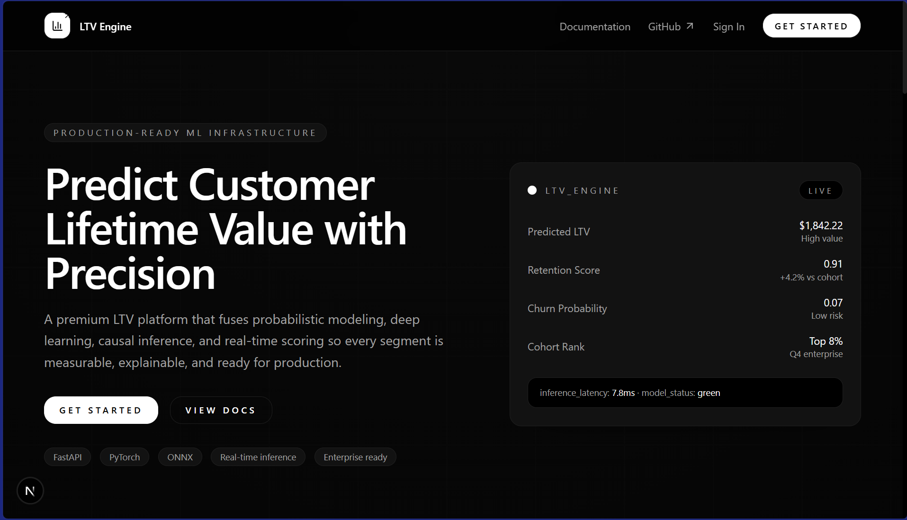
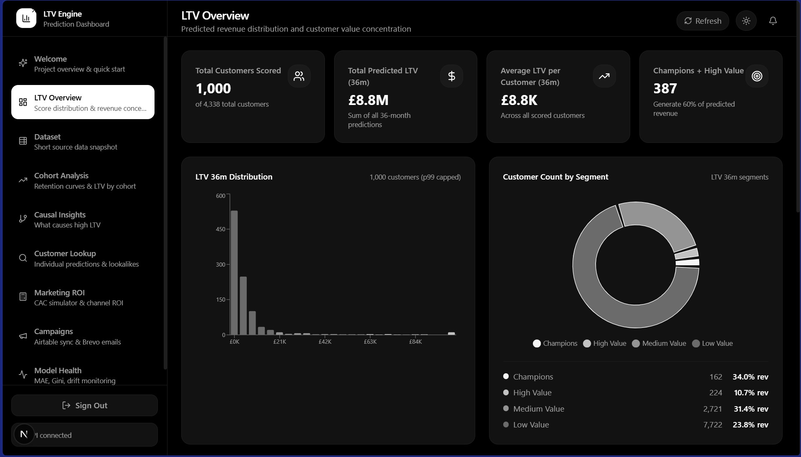
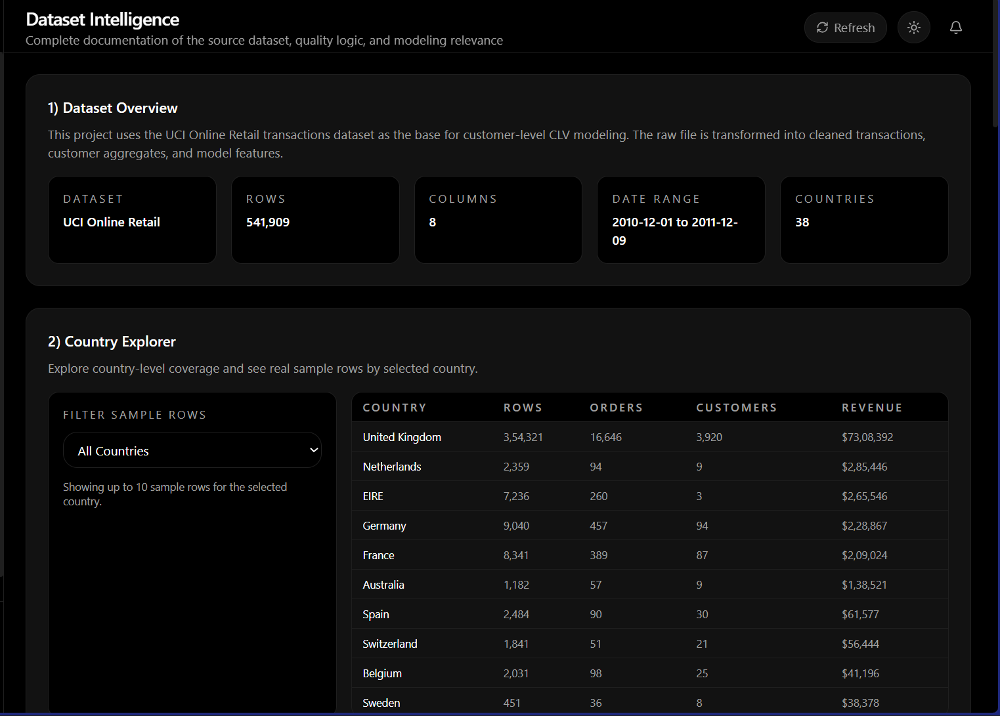
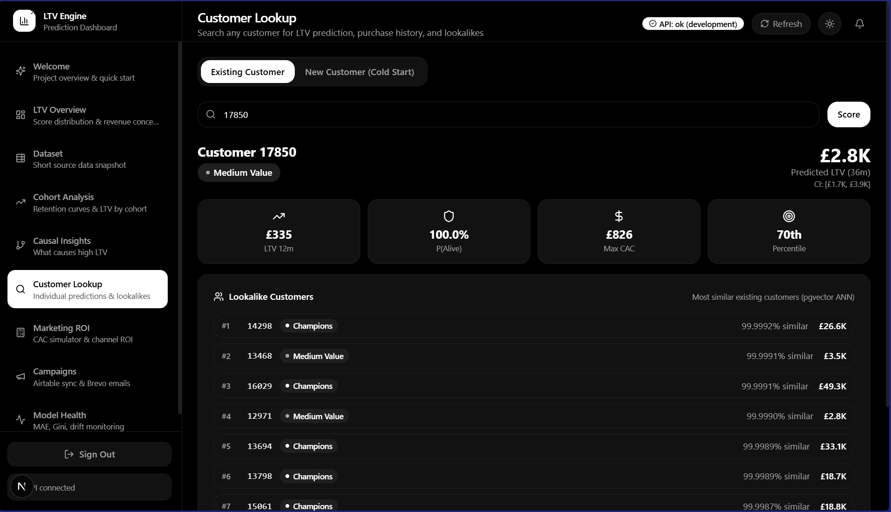
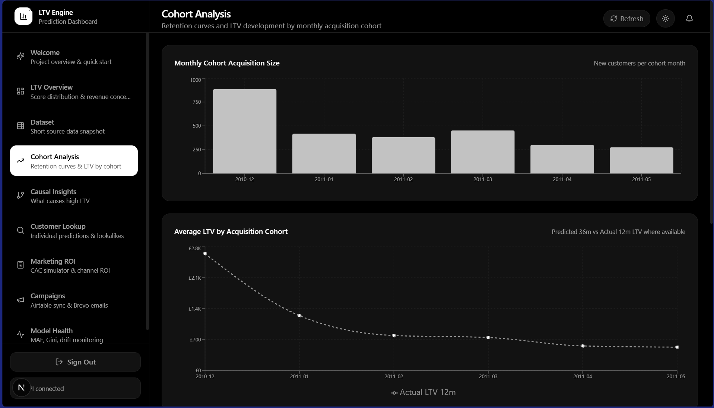
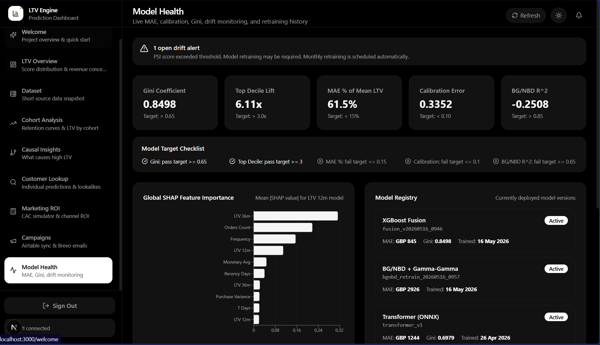
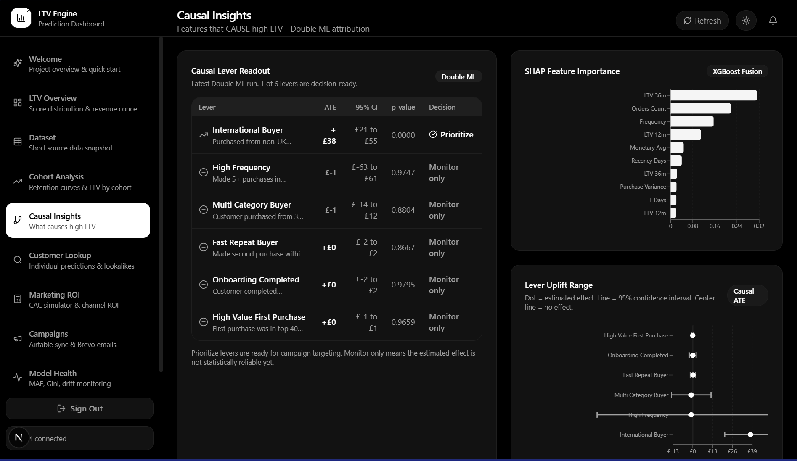
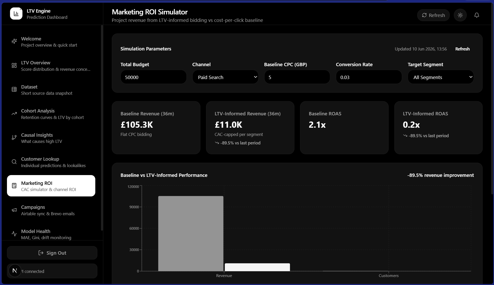
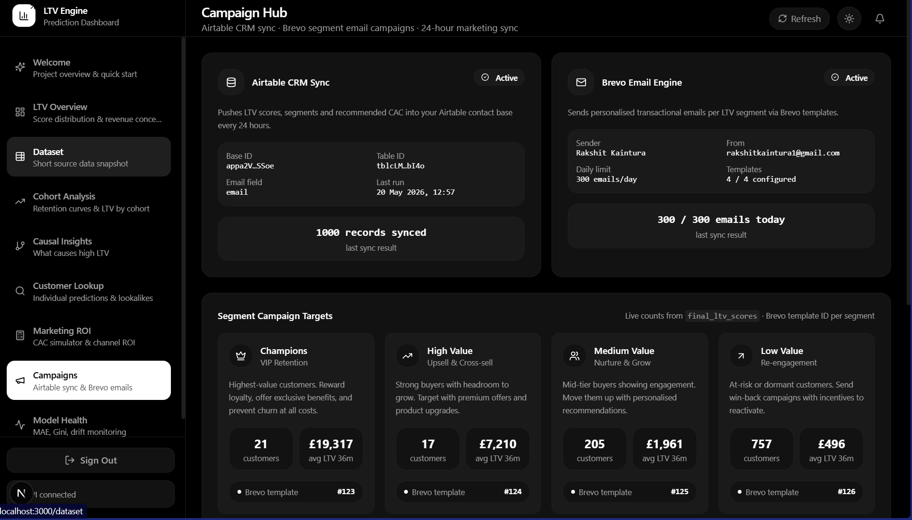

# Customer Lifetime Value (LTV) Prediction Engine

Production-ready LTV scoring service that combines probabilistic models (BG/NBD, Gamma-Gamma) with a Transformer + XGBoost fusion layer. Includes a FastAPI service, batch scoring, cold-start firmographic priors, and integration hooks.

## Highlights
- Hybrid modeling: BG/NBD + Transformer + fusion learner.
- Cold-start scoring via firmographic prior lookups.
- FastAPI service with batch scoring and segment queries.
- Supabase/Postgres integration for features, scores, and lookups.
- Dockerized local dev + Render blueprint deployment.

## Dashboard Screenshots

Here is a preview of the application's React frontend:

- **Welcome Page**  
  An introduction to the LTV Prediction Engine platform, providing navigation guidance and a high-level summary of the system architecture.
  

- **Overview**  
  A high-level KPI dashboard displaying aggregate predicted lifetime value, global revenue forecasts, and top-performing customer segment metrics.
  

- **Dataset View**  
  An interface for exploring both raw and processed data, checking feature distributions, and managing the customer records used for model training and inference.
  

- **Customer Lookup**  
  A deep-dive into individual customer profiles, showing predicted LTV, RFM (Recency, Frequency, Monetary) statistics, transaction history, and segment classification. Also supports cold-start lookups for brand-new users.
  

- **Cohort Analysis**  
  Visualizes customer retention and LTV progression over time, grouped by acquisition cohorts (e.g., by month of first purchase) to track long-term value evolution.
  

- **Model Health**  
  An ML monitoring dashboard tracking model drift, accuracy metrics (e.g., MAE, RMSE), out-of-time validation results, and feature distribution shifts.
  

- **Causal Insights**  
  Explores the causal impact of different interventions (like marketing channels or discounts) on customer lifetime value using uplift modeling.
  

- **Marketing ROI**  
  Connects predicted LTV directly to Customer Acquisition Costs (CAC) to measure return on ad spend (ROAS) and evaluate the long-term profitability of different acquisition channels.
  

- **Campaign Management**  
  An actionable interface to orchestrate targeted marketing campaigns based on LTV segments (e.g., VIP retention, churn prevention) and sync them with external integration tools like Brevo.
  

## Repository Layout
- [backend/](backend/) — Core API, ML, data access, and workers.
- [supabase/](supabase/) — Schema and migrations.
- [notebooks/](notebooks/) — EDA, experiments, and training workflows.
- [tests/](tests/) — Automated tests.
- [docker/](docker/) — Dockerfile and compose for local dev.
- [render.yaml](render.yaml) — Render blueprint configuration.

## Requirements
- Python 3.11
- UV package manager
- Supabase project (Postgres)
- Optional: Docker Desktop (for containerized runs)

## Quickstart (Local)
```powershell
uv venv --python 3.11
.venv\Scripts\Activate.ps1
uv pip install -e "[ml]"
```

Create a `.env` file (see required variables below), then run:
```powershell
uvicorn backend.api.main:app --host 0.0.0.0 --port 8000
```

API docs: `http://localhost:8000/docs`

## Environment Variables
Minimum required for full functionality:
- `SUPABASE_URL`
- `SUPABASE_SERVICE_ROLE_KEY`
- `DATABASE_URL`
- `DATABASE_URL_ASYNC`
- `API_SECRET_KEY`

Optional integrations:
- `WANDB_API_KEY`
- `AIRTABLE_API_TOKEN`
- `AIRTABLE_BASE_ID`
- `AIRTABLE_TABLE_ID`
- `BREVO_API_KEY`
- `BREVO_SENDER_EMAIL`
- `BREVO_SENDER_NAME`
- `BREVO_TEMPLATE_CHAMPIONS`
- `BREVO_TEMPLATE_HIGH`
- `BREVO_TEMPLATE_MEDIUM`
- `BREVO_TEMPLATE_LOW`
- `SEGMENT_WRITE_KEY`
- `GOOGLE_ADS_DEVELOPER_TOKEN`
- `META_ACCESS_TOKEN`

## Docker (Local)
Build:
```powershell
Set-Location docker
docker build -f Dockerfile -t ltv-api ..
```

Run:
```powershell
docker run -d --name ltv-api -p 8000:8000 --env-file ../.env ltv-api
```

## Render Deployment
This repo includes a Render blueprint at [render.yaml](render.yaml). Render will create the API and worker services on deployment.

## API Endpoints (Summary)
- `GET /health`
- `POST /score` — score existing or cold-start customers
- `POST /cold-start` — explicit cold-start scoring
- `POST /batch-score`
- `GET /customer/{id}`
- `GET /segment/{segment}`
- `GET /customer/{id}/lookalikes`

## Tests
```powershell
pytest tests/test_schemas.py -v
pytest tests/test_api.py -v
pytest tests/test_integrations.py -v
```

## Notes
- Keep secrets out of git. Rotate any keys that were shared externally.
- Ensure `models/` contains the expected artifacts (`transformer.onnx`, etc.).
